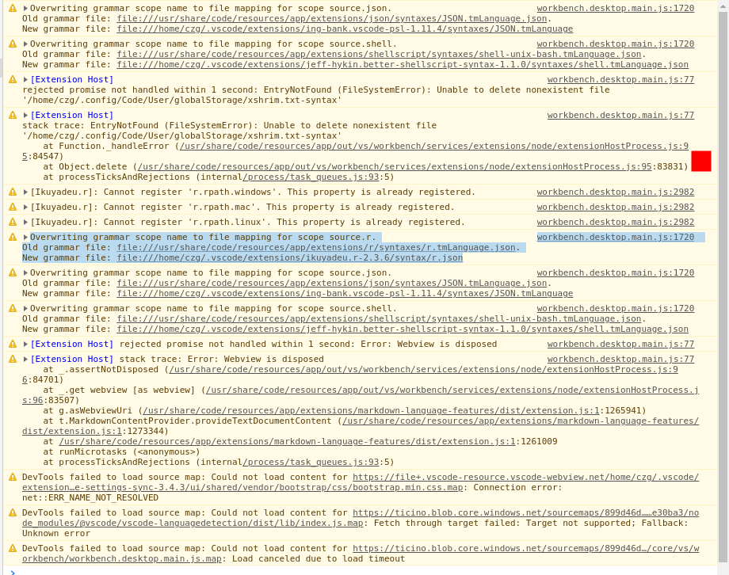
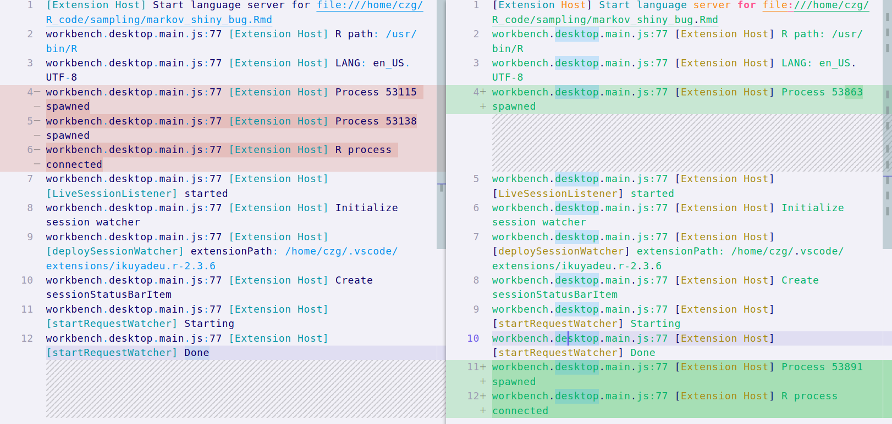

<!-- Is the issue about auto-completion, hover help, go to definition,
  document highlight,  document outline/symbols, workspace symbols, formatting, 
  document link, document color and color picker?
  If so it is more likely an issue with the language server.
  Please report issue at <https://github.com/REditorSupport/languageserver/issues>. -->

# use the method listed in `README.md`
> in `README.md`
> > use the correct **language mode** to enable Rmarkdown **features**
> > > notice the **status bar**changes

**Describe the bug**
A clear and concise description of what the bug is.

- I can enable `Rmarkdown` features by disabling(reload then) `R plugin` and enable again
- but `Rmarkdown` features don‘t work every time when I **reload the window** or open a workspace

**To Reproduce**
Steps to reproduce the behavior:

1. Go to 'develop tools'
2. trace 'info level in console ' when taking action
4. See error

## Do you want to fix by self? (We hope your help!)

- I tried but didn‘t work
  - I guess it may be related to json config by noticing `warning info` in the `develper tool` when the `Rmarkdown` is supported.****
    ```
    workbench.desktop.main.js:sourcemap:1720 Overwriting grammar scope name to file mapping for scope source.r.

    Old grammar file: file:///usr/share/code/resources/app/extensions/r/syntaxes/r.tmLanguage.json.

    New grammar file: file:///home/czg/.vscode/extensions/ikuyadeu.r-2.3.6/syntax/r.json
    ```
    - after copying `r.json` to `r.tmLanguage.json.`， no use
    - the red dot is where to **reenable the extension**
      
      <!--  -->
  - then I searched `info level ` in `developer tools console`
    - the diff without （[left](./sampling/R_markdown_developer_tool_vscode.log) ）and with [right](./sampling/R_markdown_developer_tool_vscode_success_with_restart_plugin.log) reenableing the **extension**
      <!--  -->
      
      - maybe the processing order matters. but it is weird that the process order **differs**

## (If yes,) what kind of help do you want? (e.g. Which file should I fix, Survey (related documents)

(If related)setting.json

```jsonc
"files.associations": {
        "*.json": "jsonc",
        "*.rmd": "markdown",
        "*.Rmd": "r"
    },
"r.rpath.linux": "/usr/bin/R",
"r.bracketedPaste": true,
"r.lsp.enabled": true,
"r.lsp.diagnostics": true,
// "r.lsp.diagnostics": false,
// "r.lsp.args": ["--colors"],
"r.lsp.debug": true,
"r.rterm.linux": "/usr/local/bin/radian",
"r.plot.defaults.colorTheme": "vscode",
// "[r]": {
//     "editor.defaultFormatter": "Ikuyadeu.r"
// },
// https://renkun.me/2019/12/26/writing-r-in-vscode-interacting-with-an-r-session/
"r.sessionWatcher": true,
// "r.se"
// "r.plot.defaults.plotPreviewLayout": "multirow",
"r.previewDataframe": true, // use shortcut Ctrl+U to invock View
"r.helpPanel.enableHoverLinks": false,
"r.helpPanel.enableSyntaxHighlighting": true,
"r.plot.useHttpgd": true,
// "r.shinyWebView": "external",
"[r]": {
    "editor.defaultFormatter": "Ikuyadeu.r",
    "editor.formatOnSave": true
},
"[rmd]": {
    "editor.defaultFormatter": "Ikuyadeu.r",
    "editor.formatOnSave": true
},
"r.alwaysUseActiveTerminal": true,
"r.workspaceViewer.showObjectSize": true,
// "r.editor.formatOnType": true,
// "r.linting.enable": true,

"r.rmarkdown.chunkBackgroundColor": "rgba(128, 128, 128, 0.1)",
"r.rmarkdown.enableCodeLens": true,
"r.rmarkdown.codeLensCommands": [
    "r.runCurrentChunk",
    "r.runAboveChunks",
    "r.runNextChunk",
    "r.runPreviousChunk",
],
"r.rmarkdown.preview.autoRefresh": true,
"multiCommand.commands": [
    {
        "command": "multiCommand.r.go.previous.chunk.center",
        "sequence": [
            "r.goToPreviousChunk",
            "center-editor-window.center"
        ]
    },
    {
        "command": "multiCommand.r.go.next.chunk.center",
        "sequence": [
            "r.goToNextChunk",
            "center-editor-window.center"
        ]
    }
],

// R.exe path for windows
"r.rterm.windows": "",

// R path for Mac OS X
"r.rterm.mac": "/usr/local/bin/R",

// R path for Linux
"r.rterm.linux": "/usr/bin/R",

// R command line options (i.e: --vanilla)
"r.rterm.option": [],

// An optional encoding to pass to R when executing the file, i.e. 'source(FILE, encoding=ENCODING)'
"r.source.encoding": "UTF-8",

// Keeping focus when running
"r.source.focus": "editor",

// Use active terminal for all commands, rather than creating a new R terminal
"r.alwaysUseActiveTerminal": false,

// Use bracketed paste mode
"r.bracketedPaste": false,

// Enable R session watcher
"r.sessionWatcher": true,

// Delay in milliseconds before sending each line to rterm (only applies if r.bracketedPaste is false)
"r.rtermSendDelay": 8,
```

**Expected behavior**
A clear and concise description of what you expected to happen.

auto have `Rmarkdown` features when opening Rmd like trunks execution

**Screenshots**
If applicable, add screenshots to help explain your problem.
You can show the keybord contents by pressing `F1` and `Developer: toggle screencast mode`


**Environment (please complete the following information):**

- OS: [e.g. Windows, macOS, Linux]
- VSCode Version: [e.g. 1.42.0]
- R Version: [e.g. 3.6.2]
- vscode-R version: [e.g. 1.2.2]

**Additional context**
Add any other context about the problem here.
