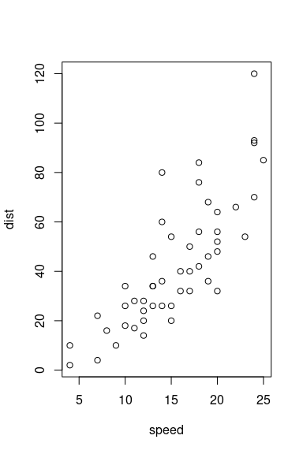

## Next Steps {#nextsteps .emphasized}
#nextsteps {
   color: blue;
}

.emphasized {
   font-size: 1.2em;
}

## Quarterly Results {.tabset}

### By Product

(tab content)

### By Region

(tab content)

## Quarterly Results {.tabset .tabset-fade .tabset-pills}

### By Product

(tab content)

### By Region

(tab content)

This is an R Markdown document. Markdown is a simple formatting syntax for authoring HTML, PDF, and Microsoft Word documents. For more details on using R Markdown see <http://rmarkdown.rstudio.com>.

When you select the **R Tools | Publish | Preview** button, a document will be generated that includes both content as well as the output of any embedded R code chunks within the document. You can embed an R code chunk like this:


```r
summary(cars)
```

```
##      speed           dist       
##  Min.   : 4.0   Min.   :  2.00  
##  1st Qu.:12.0   1st Qu.: 26.00  
##  Median :15.0   Median : 36.00  
##  Mean   :15.4   Mean   : 42.98  
##  3rd Qu.:19.0   3rd Qu.: 56.00  
##  Max.   :25.0   Max.   :120.00
```


```r
mtcars
```


--------------------------------------------------------------------------------
         &nbsp;            mpg    cyl   disp    hp    drat    wt     qsec    vs 
------------------------- ------ ----- ------- ----- ------ ------- ------- ----
      **Mazda RX4**         21     6     160    110   3.9    2.62    16.46   0  

    **Mazda RX4 Wag**       21     6     160    110   3.9    2.875   17.02   0  

     **Datsun 710**        22.8    4     108    93    3.85   2.32    18.61   1  

   **Hornet 4 Drive**      21.4    6     258    110   3.08   3.215   19.44   1  

  **Hornet Sportabout**    18.7    8     360    175   3.15   3.44    17.02   0  

       **Valiant**         18.1    6     225    105   2.76   3.46    20.22   1  

     **Duster 360**        14.3    8     360    245   3.21   3.57    15.84   0  

      **Merc 240D**        24.4    4    146.7   62    3.69   3.19     20     1  

      **Merc 230**         22.8    4    140.8   95    3.92   3.15    22.9    1  

      **Merc 280**         19.2    6    167.6   123   3.92   3.44    18.3    1  

      **Merc 280C**        17.8    6    167.6   123   3.92   3.44    18.9    1  

     **Merc 450SE**        16.4    8    275.8   180   3.07   4.07    17.4    0  

     **Merc 450SL**        17.3    8    275.8   180   3.07   3.73    17.6    0  

     **Merc 450SLC**       15.2    8    275.8   180   3.07   3.78     18     0  

 **Cadillac Fleetwood**    10.4    8     472    205   2.93   5.25    17.98   0  

 **Lincoln Continental**   10.4    8     460    215    3     5.424   17.82   0  

  **Chrysler Imperial**    14.7    8     440    230   3.23   5.345   17.42   0  

      **Fiat 128**         32.4    4    78.7    66    4.08    2.2    19.47   1  

     **Honda Civic**       30.4    4    75.7    52    4.93   1.615   18.52   1  

   **Toyota Corolla**      33.9    4    71.1    65    4.22   1.835   19.9    1  

    **Toyota Corona**      21.5    4    120.1   97    3.7    2.465   20.01   1  

  **Dodge Challenger**     15.5    8     318    150   2.76   3.52    16.87   0  

     **AMC Javelin**       15.2    8     304    150   3.15   3.435   17.3    0  

     **Camaro Z28**        13.3    8     350    245   3.73   3.84    15.41   0  

  **Pontiac Firebird**     19.2    8     400    175   3.08   3.845   17.05   0  

      **Fiat X1-9**        27.3    4     79     66    4.08   1.935   18.9    1  

    **Porsche 914-2**       26     4    120.3   91    4.43   2.14    16.7    0  

    **Lotus Europa**       30.4    4    95.1    113   3.77   1.513   16.9    1  

   **Ford Pantera L**      15.8    8     351    264   4.22   3.17    14.5    0  

    **Ferrari Dino**       19.7    6     145    175   3.62   2.77    15.5    0  

    **Maserati Bora**       15     8     301    335   3.54   3.57    14.6    0  

     **Volvo 142E**        21.4    4     121    109   4.11   2.78    18.6    1  
--------------------------------------------------------------------------------

Table: Table continues below

 
--------------------------------------------
         &nbsp;            am   gear   carb 
------------------------- ---- ------ ------
      **Mazda RX4**        1     4      4   

    **Mazda RX4 Wag**      1     4      4   

     **Datsun 710**        1     4      1   

   **Hornet 4 Drive**      0     3      1   

  **Hornet Sportabout**    0     3      2   

       **Valiant**         0     3      1   

     **Duster 360**        0     3      4   

      **Merc 240D**        0     4      2   

      **Merc 230**         0     4      2   

      **Merc 280**         0     4      4   

      **Merc 280C**        0     4      4   

     **Merc 450SE**        0     3      3   

     **Merc 450SL**        0     3      3   

     **Merc 450SLC**       0     3      3   

 **Cadillac Fleetwood**    0     3      4   

 **Lincoln Continental**   0     3      4   

  **Chrysler Imperial**    0     3      4   

      **Fiat 128**         1     4      1   

     **Honda Civic**       1     4      2   

   **Toyota Corolla**      1     4      1   

    **Toyota Corona**      0     3      1   

  **Dodge Challenger**     0     3      2   

     **AMC Javelin**       0     3      2   

     **Camaro Z28**        0     3      4   

  **Pontiac Firebird**     0     3      2   

      **Fiat X1-9**        1     4      1   

    **Porsche 914-2**      1     5      2   

    **Lotus Europa**       1     5      2   

   **Ford Pantera L**      1     5      4   

    **Ferrari Dino**       1     5      6   

    **Maserati Bora**      1     5      8   

     **Volvo 142E**        1     4      2   
--------------------------------------------


```r
mtcars
```


--------------------------------------------------------------------------------
         &nbsp;            mpg    cyl   disp    hp    drat    wt     qsec    vs 
------------------------- ------ ----- ------- ----- ------ ------- ------- ----
      **Mazda RX4**         21     6     160    110   3.9    2.62    16.46   0  

    **Mazda RX4 Wag**       21     6     160    110   3.9    2.875   17.02   0  

     **Datsun 710**        22.8    4     108    93    3.85   2.32    18.61   1  

   **Hornet 4 Drive**      21.4    6     258    110   3.08   3.215   19.44   1  

  **Hornet Sportabout**    18.7    8     360    175   3.15   3.44    17.02   0  

       **Valiant**         18.1    6     225    105   2.76   3.46    20.22   1  

     **Duster 360**        14.3    8     360    245   3.21   3.57    15.84   0  

      **Merc 240D**        24.4    4    146.7   62    3.69   3.19     20     1  

      **Merc 230**         22.8    4    140.8   95    3.92   3.15    22.9    1  

      **Merc 280**         19.2    6    167.6   123   3.92   3.44    18.3    1  

      **Merc 280C**        17.8    6    167.6   123   3.92   3.44    18.9    1  

     **Merc 450SE**        16.4    8    275.8   180   3.07   4.07    17.4    0  

     **Merc 450SL**        17.3    8    275.8   180   3.07   3.73    17.6    0  

     **Merc 450SLC**       15.2    8    275.8   180   3.07   3.78     18     0  

 **Cadillac Fleetwood**    10.4    8     472    205   2.93   5.25    17.98   0  

 **Lincoln Continental**   10.4    8     460    215    3     5.424   17.82   0  

  **Chrysler Imperial**    14.7    8     440    230   3.23   5.345   17.42   0  

      **Fiat 128**         32.4    4    78.7    66    4.08    2.2    19.47   1  

     **Honda Civic**       30.4    4    75.7    52    4.93   1.615   18.52   1  

   **Toyota Corolla**      33.9    4    71.1    65    4.22   1.835   19.9    1  

    **Toyota Corona**      21.5    4    120.1   97    3.7    2.465   20.01   1  

  **Dodge Challenger**     15.5    8     318    150   2.76   3.52    16.87   0  

     **AMC Javelin**       15.2    8     304    150   3.15   3.435   17.3    0  

     **Camaro Z28**        13.3    8     350    245   3.73   3.84    15.41   0  

  **Pontiac Firebird**     19.2    8     400    175   3.08   3.845   17.05   0  

      **Fiat X1-9**        27.3    4     79     66    4.08   1.935   18.9    1  

    **Porsche 914-2**       26     4    120.3   91    4.43   2.14    16.7    0  

    **Lotus Europa**       30.4    4    95.1    113   3.77   1.513   16.9    1  

   **Ford Pantera L**      15.8    8     351    264   4.22   3.17    14.5    0  

    **Ferrari Dino**       19.7    6     145    175   3.62   2.77    15.5    0  

    **Maserati Bora**       15     8     301    335   3.54   3.57    14.6    0  

     **Volvo 142E**        21.4    4     121    109   4.11   2.78    18.6    1  
--------------------------------------------------------------------------------

Table: Table continues below

 
--------------------------------------------
         &nbsp;            am   gear   carb 
------------------------- ---- ------ ------
      **Mazda RX4**        1     4      4   

    **Mazda RX4 Wag**      1     4      4   

     **Datsun 710**        1     4      1   

   **Hornet 4 Drive**      0     3      1   

  **Hornet Sportabout**    0     3      2   

       **Valiant**         0     3      1   

     **Duster 360**        0     3      4   

      **Merc 240D**        0     4      2   

      **Merc 230**         0     4      2   

      **Merc 280**         0     4      4   

      **Merc 280C**        0     4      4   

     **Merc 450SE**        0     3      3   

     **Merc 450SL**        0     3      3   

     **Merc 450SLC**       0     3      3   

 **Cadillac Fleetwood**    0     3      4   

 **Lincoln Continental**   0     3      4   

  **Chrysler Imperial**    0     3      4   

      **Fiat 128**         1     4      1   

     **Honda Civic**       1     4      2   

   **Toyota Corolla**      1     4      1   

    **Toyota Corona**      0     3      1   

  **Dodge Challenger**     0     3      2   

     **AMC Javelin**       0     3      2   

     **Camaro Z28**        0     3      4   

  **Pontiac Firebird**     0     3      2   

      **Fiat X1-9**        1     4      1   

    **Porsche 914-2**      1     5      2   

    **Lotus Europa**       1     5      2   

   **Ford Pantera L**      1     5      4   

    **Ferrari Dino**       1     5      6   

    **Maserati Bora**      1     5      8   

     **Volvo 142E**        1     4      2   
--------------------------------------------

You can also embed plots, for example:

<!-- -->

Note that the `echo = FALSE` parameter was added to the code chunk to prevent printing of the R code that generated the plot.


> no use `setup` in `{r setup, include=FALSE}`


```r
library("nloptr")
hn <- function(x, n) {
    hret <- 0
    if (n == 0) {
        hret <- x + 2 * x
    } else {
        hret <- x - 2 * x
    }
    return(hret)
}
```


```bash
source ~/.bashrc


pwd
ls
export http_proxy=127.0.0.1:1081
export https_proxy=127.0.0.1:1081
```

```
## /home/czg/R_code/sampling
## Markov_Chain_Stationary_Distributions.R
## markov_files
## markov.Rmd
## Markov_Rmd.R
## markov_shiny_bug.Rmd
```

{python, engine.path =  "/home/username/anaconda3/envs/virtualenv/bin/python", fig.height = 3, fig.width = 6}


```r
library(reticulate)

use_python("~/venv/bin/python", 
           required = T) # Locate and run Python
```


[tutorial](https://www.stat.berkeley.edu/~mgoldman/Section0220.pdf)
[also](https://cran.r-project.org/doc/manuals/r-release/R-intro.html#Using-R-interactively)


```r
a <- solve(matrix(c(-.4, .1, .2, .1, -.3, .2, 1, 1, 1), nrow = 3, byrow = T), c(0, 0, 1))
```
----


```r
x <- matrix(c(.6, .1, .3, .1, .7, .2, .2, .2, .6), nrow = 3, byrow = T)
y <- x
for (i in 1:25) {
      y <- y %*% x
  }
```


```r
twosam <- function(y1, y2) {
    n1 <- length(y1)
    n2 <- length(y2)
    yb1 <- mean(y1)
    yb2 <- mean(y2)
    s1 <- var(y1)
    s2 <- var(y2)
    s <- ((n1 - 1) * s1 + (n2 - 1) * s2) / (n1 + n2 - 2)
    tst <- (yb1 - yb2) / sqrt(s * (1 / n1 + 1 / n2))
    tst
}

group1 <- rnorm(100)
group2 <- rnorm(100, mean = .1)

test <- twosam(group1, group2)
test2 <- t.test(group1, group2)
```


```python
print("Hello Python!")
```

```
## Hello Python!
```


```r
library(reticulate)
```

Create a variable `x` in the Python session:


```python
x = [1, 2, 3]
```

Access the Python variable `x` in an R code chunk:


```r
py$x
```

```
## [1] 1 2 3
```

Create a new variable `y` in the Python session using R,
and pass a data frame to `y`:


```r
py$y <- head(cars)
```

Print the variable `y` in Python:


```python
print(y)
```

```
## {'speed': [4.0, 4.0, 7.0, 7.0, 8.0, 9.0], 'dist': [2.0, 10.0, 4.0, 22.0, 16.0, 10.0]}
```


```r
library(reticulate)
os <- import("os")
os$listdir(".")
```

```
## [1] "markov.Rmd"                              "markov_files"                           
## [3] "markov_shiny_bug.Rmd"                    "Markov_Chain_Stationary_Distributions.R"
## [5] "Markov_Rmd.R"
```


```r
library(reticulate)
```

